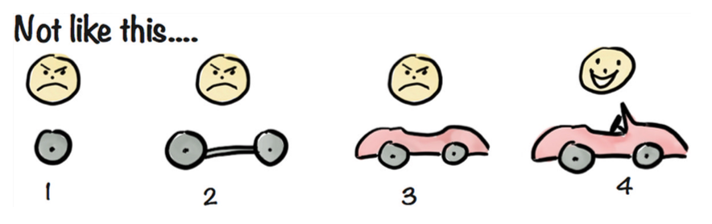
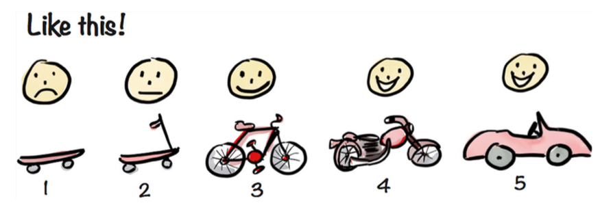
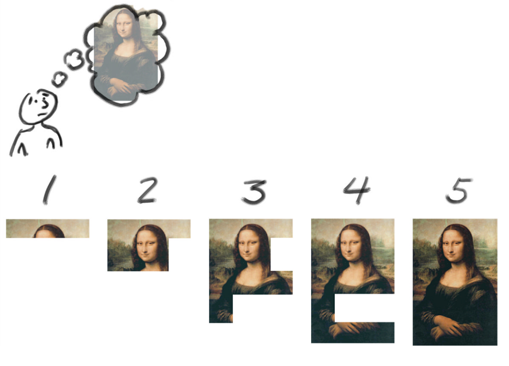
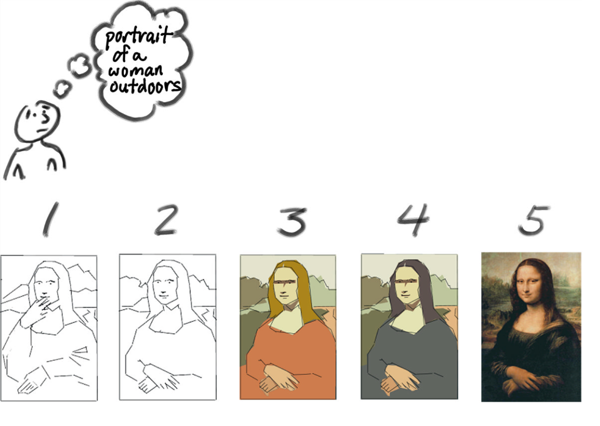
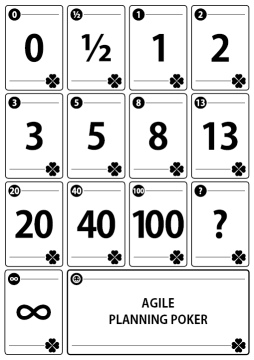

footer: Software project – Lecture 0
slidenumbers: true

# Software Project
### Scrum for supervisors

## Wouter Swierstra

--------------------------------------------------------------------------------

# The Software Project

During the Software Project, students develop a substantial piece of software for an external party.

At the moment, we give students the freedom to organize themselves as they see fit.

This is good: they learn to appreciate how hard it is to organize a development team.

This is bad: it makes it harder for us to help them, to judge individual's performance, or how well the team collaborated.

--------------------------------------------------------------------------------

# Why change?

Agile & Scrum are desirable skills – we should teach them.

Students are interested interested in Scrum, but are not disciplined enough to implement it well.

It provides more structure for the supervisors.

It makes your job easier.

It will improve the product students deliver and what they learn.

--------------------------------------------------------------------------------

# The software project

* Limited resources: time, people, means.

* Equally experienced developers

* Committed customers; not many troublesome stakeholders

* Typically, no huge existing codebase.

--------------------------------------------------------------------------------

# Scrum

Scrum is an Agile software development process that is:

- *iterative* – repeated fixed steps to converge on a working product.

- *incremental* – functionality is designed, implemented and tested repeatedly (as opposed to, say the Waterfall model)

- encourages *self-organization*

--------------------------------------------------------------------------------

# The Scrum process - I

* Together with the product owner (the client), students will create a prioritized 'wishlist of features' called the *product backlog*

* These features are specified as *user stories* rather than complete requirements.

* The development team takes a small number of stories from the top of the backlog: sprint backlog.

* These stories are completely implemented and tested in a single *iteration* (2 weeks).

--------------------------------------------------------------------------------

# The Scrum process - II

* Students hold daily meetings to assess their progress

* At the end of the sprint, the stories should be completely implemented. There should be a shippable product increment.

* The iteration ends with a demo for the client.

* After each iteration, hold a sprint review: how can we improve the next sprint.

* Plan the next sprint, establishing a new sprint backlog

--------------------------------------------------------------------------------

--------------------------------------------------------------------------------

# The Scrum team

There are three roles in the Scrum:

* The Product Owner

* The Scrum Master

* The Development team

* (The UU Supervisors)

--------------------------------------------------------------------------------

# The Product Owner (*opdrachtgever*)

The Product Owner is a single person representing all stakeholders:

- Helps prioritize the product backlog
- Responsible for product vision
- Accepts or rejects product increments

--------------------------------------------------------------------------------

# The Scrum Master

The Scrum Master is responsible for making sure the process is smooth:

- remove outside distractions;
- chair review meetings or the daily standup;
- facilitates the process, without being a a project *manager*.
- (In the context of the Software Project), manages the product backlog

--------------------------------------------------------------------------------

# Coach

The coach is not an offical part of the scrum, but in the context of the Software Project, we advise teams to appoint a coach:

- monitors happiness of the team;
- addresses any arguments;
- ensures collaboration is smooth;
- reports back to the supervisor about any problems.

--------------------------------------------------------------------------------

# The Development Team

- All the other students.
- No specific roles for testing, design, etc.
- They all share ownership of the code.
- They organize yourself – all outside influence goes through the Scrum Master and Product Owner.

--------------------------------------------------------------------------------

# Where do you fit in?

In the current situation, you hold weekly meetings.

*Supervisor:* How is it going?
*Students:* Fine.

By forcing students to a clearly defined process, we can improve supervision.

We will ask students to use the same system (Gitlab, Github, or perhaps EasyBacklog) to manage their backlog. Be sure to request access.

--------------------------------------------------------------------------------

# Scrum supervision suggestion

Hold a bi-weekly meeting with the entire team to review the past sprint and plan the next sprint:

* What stories did you fail to complete this iteration? Why?

* What went well this iteration? What needs to be improved?

* How did the client respond to the demo?

Every other week, have a short meeting with the Scrum Master/Coach and another (rotating) team member.

--------------------------------------------------------------------------------

# Planning: incremental development

--------------------------------------------------------------------------------

# Planning: incremental development

Customers do not know what they want.

By iteratively refining a working system you will hopefully converge on a product with which they are happy...

... if you only deliver a working system towards the end of the project, you run the risk of building the wrong thing.

--------------------------------------------------------------------------------

# Planning: minimize technical risk

--------------------------------------------------------------------------------

# Planning: minimize technical risk

For this project, students will need to learn and apply technology with which they are not familiar.

This is a huge risk!

Encourage them to have a complete system up and running as soon as possible, even if it only has a fraction of the features.

--------------------------------------------------------------------------------

# Planning meeting

What are the most important next stories in the product backlog?

This means prioritizing stories and making a realistic estimation of how much they can do in two weeks.

This way you monitor *what* they're working on, *who* is ambitious, and how the group dynamics work.

--------------------------------------------------------------------------------

# Which stories this iteration?

This should give you some idea which *must-have* stories you should try to complete in the first iterations.

But how many can you deliver?

And who will do what?

--------------------------------------------------------------------------------

# Planning poker

All team members have a set of cards.

Every team member chooses the card with the number of *story points*, estimating how much work a story will be.

Unless there is a consensus, the people with the highest and lowest estimates motivate their choice.

Make new estimations until the team agrees.

--------------------------------------------------------------------------------

# What are story points?

People are really bad at accurate estimates.

One story point does not correspond to a fixed amount of work – instead they try to measure *relative effort*.

Keep stories small – between one and ten points.

The idea behind using story points is that it is impossible to estimate the amount of work on a software component that hasn't been developed, using unfamiliar technology, that relies on other components that haven't been written yet.

--------------------------------------------------------------------------------

# Development velocity

Measuring how many story points your team completes in an iteration, this gives you an indication of your *development velocity*.

Use your development velocity when planning stories for the next iteration.

Don't bite off more than you can chew.

--------------------------------------------------------------------------------

# Assessing an individual's contribution

Which stories did they deliver?

How many story points did they deliver?

How often were their stories left unfinished?

Were they identified as a bottleneck in the sprint reviews?

--------------------------------------------------------------------------------

# Questions?

--------------------------------------------------------------------------------

# More information

Lots of info available online:

* [http://www.scrumalliance.org](http://www.scrumalliance.org)

* [http://scrummethodology.com/](http://scrummethodology.com/)

* [http://www.mountaingoatsoftware.com/](http://www.mountaingoatsoftware.com/)

--------------------------------------------------------------------------------

# Learn more

Free Scrum training videos:

  [http://scrummethodology.com/](http://scrummethodology.com/)

Check out the reference card:

  [http://scrumreferencecard.com/scrum-reference-card/](http://scrumreferencecard.com/scrum-reference-card/)

--------------------------------------------------------------------------------
