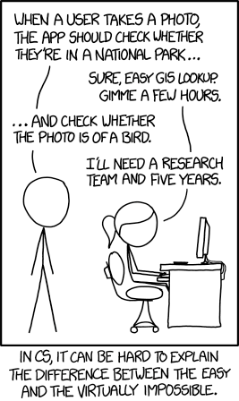
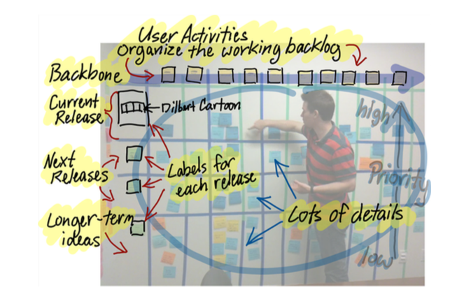
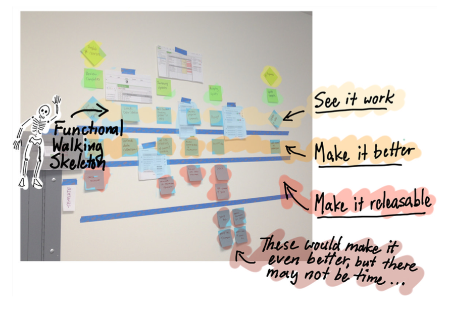

footer: Software project – Lecture 2
slidenumbers: true

# Software Project
### Lecture 2

### Wouter Swierstra

--------------------------------------------------------------------------------

# Last time

* Introduction to the Software Project

* Marshmallow challenge

* Scrum and Agile software development

--------------------------------------------------------------------------------

# Today

   

* Establishing a product backlog

* Planning effectively

--------------------------------------------------------------------------------

# An inconvenient truth

## Your customers don't know what they want.

--------------------------------------------------------------------------------

# Your customer is clueless

--------------------------------------------------------------------------------

# Customer wishlist: a real example

I want a serious game for teaching X.

We want to use it to teach BSc, MSc, and PhD students.

The game should adapt to the level of expertise of the player.

It should be customizable to teach different flavors of X.

It should look pretty and run on every device imaginable.

The moon on a stick.

--------------------------------------------------------------------------------

# The good news

We try to:

* define projects that fit in the scope of the software project

* manage customer expectations

* coach the student teams

But you still need to do a lot of hard work.

--------------------------------------------------------------------------------

> Our customer still hasn't told us what his requirements are...
>   -- A student

--------------------------------------------------------------------------------

# How can you determine what your customer wants?

--------------------------------------------------------------------------------

# Step-by-step plan to Agile success[^1]

1. Establish a common vision

1. Fill the product backlog

1. MoSCoW Milestones

[^1]: As proposed by Mightybytes.com

--------------------------------------------------------------------------------

# Establishing a common vision[^2]

- FOR (target customer)
- WHO (statement of the need or opportunity)
- THE (product name) is a (product category)
- THAT (key benefit)
- UNLIKE (competitor/current software) OUR PRODUCT (primary differentiator)

[^2]: From Geoffrey Moore's [Crossing the Chasm](http://en.wikipedia.org/wiki/Crossing_the_Chasm)

--------------------------------------------------------------------------------

# Example: aleph library website

FOR students at the Universiteit Utrecht WHO need to request books, extend loans, or query the collection THE aleph.uu.nl website is an online service THAT gives students access to the library's collection and their accounts THAT they can use from home UNLIKE the current situation where they need to go the library physically.

--------------------------------------------------------------------------------

# Formulate such a vision for your product.

^ Actually, this is the product owner's job. This is a good exercise to see if you're on the same page.

^ Where are the open questions?

^ What bits did you find hard to fill in?

--------------------------------------------------------------------------------

# Step-by-step plan to Agile success

1. Establish a common vision

1. **Fill the product backlog**

1. MoSCoW Milestones

--------------------------------------------------------------------------------

# Establish a product backlog

Sit down with the development team and the product owner.

Everyone has a stack of notecards and a pen.

Write down scenarios or *user stories* on cards.

This forms your initial product backlog.

**Focus on user experience.**

--------------------------------------------------------------------------------

# The users, not the system

As a (user role), I can (do something) so that...

- As a *student*, I can *check the books I have on loan*, so that I can avoid accumulating fines.

Avoid talking about the system:

- The system has drop-downs to show the current books on loan.

--------------------------------------------------------------------------------

# What other user stories can you think of for the UU website?

--------------------------------------------------------------------------------

# Step-by-step plan to Agile success

1. Establish a common vision

1. Fill the product backlog

1. **MoSCoW Milestones**

--------------------------------------------------------------------------------

# Negotiation

* Stakeholders may have different interests...

* How will you prioritise stories?

* Which stories will you deliver first?

* Which stories are you willing to sacrifice?

--------------------------------------------------------------------------------

# MoSCoW

* Must haves (without this feature the project has no value)

* Should haves (features you are willing to sacrifice if time is short)

* Could haves (desirable features once the product is stable)

* Won't haves (features you will not be able to implement)

--------------------------------------------------------------------------------

# Prioritizing the product backlog

**Together with your client** categorize stories as M,S,C,W.

Go through each pile again. Is this feature really necessary?

There **must** be a serious game, playable online.

It **should** be customizable or scriptable.

It **could** run on mobile devices.

It **won't** adapt to a player's expertise.

--------------------------------------------------------------------------------

# Prioritizing the product backlog

Some people argue that the product backlog must be linearly order – you must have a complete ranking of all stories.

Personally, I think this is unrealistic and hard to maintain.

A rough classification – M, S, C – is good enough.

--------------------------------------------------------------------------------

# How would you classify the user stories you listed previously?

--------------------------------------------------------------------------------

# Step-by-step plan to Agile success

1. Establish a common vision

1. Fill the product backlog

1. MoSCoW Milestones

Upon completion you will have:

* A shared vision of what you are going to build

* A prioritized product backlog with user stories

--------------------------------------------------------------------------------

# Manage your backlog

Your backlog can quickly become unmanageable

You **must** be disciplined about controlling your backlog.

There is a lot of software available to help:

* [EasyBacklog](https://easybacklog.com) (recommended)

* [GitHub issue tracker](http://www.position-absolute.com/articles/agile-workflow-with-github-issues/) or [Jira](http://blogs.atlassian.com/2013/04/how-to-manage-a-product-backlog-with-ease/)

Share your backlog with your UU supervisor; do *not* share it with your client.

--------------------------------------------------------------------------------

# What next?

* How can you turn stories into software?

* Which *must-have story* should you implement first?

* How can you transition from a blank slate to a working product?

* How can you organize your stories into *milestones*?

These are still open questions...

--------------------------------------------------------------------------------

# Case study: SMOI

--------------------------------------------------------------------------------

The Strategic Management of Organizations and ICT (SMOI) course runs a simulation game with teams of students.

Each team submits an Excel file with lots of data, corresponding to strategic decisions they make for a certain quarter: how much beer to produce, where to ship their stocks, or how much to spend on advertising, etc.

These Excel forms are processed manually by the lecturers. The results are communicated back to the students.

Your task: build an online websystem to automate this process.

--------------------------------------------------------------------------------

# Further requirements

* The students should be warned about bogus or invalid data.

* The lecturers should be able to view all student data.

* The system should be completely adaptable, so that it can be used for other simulation games.

* The teams should have homepages that are customizable.

* The system should support some notification/messaging system.

--------------------------------------------------------------------------------

# What would you do first? Why?

--------------------------------------------------------------------------------

## But that's too much work for one iteration!

## How could you make it smaller?

--------------------------------------------------------------------------------

# Epics

Stories that are too much work for one iteration are called *epics*.

Typically, you can identify the most important next story easily.

Break this into smaller pieces.

Some of these pieces may be lower priority.

--------------------------------------------------------------------------------

# Not just epics

Some of the stories in the product backlog may have problems:

* Not be precisely defined. 

* Too big.

* Not ready to be implemented

But they are prioritized!

Part of *product backlog grooming* is defining these stories.

--------------------------------------------------------------------------------

# Product backlog
  

Prioritized stories - divided into iterations
$$ \qquad \qquad \qquad \qquad \qquad \qquad \qquad \qquad$$  Epics & low priority stories

--------------------------------------------------------------------------------

# How can you break the main SMOI story into smaller pieces?

--------------------------------------------------------------------------------

# Breaking epics

- **Split** – break the epic into small stories.

- **Stub** – make a stub implementation so that this story does not block development (a Database class that returns the same answer for every query)

- **Spike** – an experiment to learn how to estimate, plan, or split a story (a toy database that runs on the production server)

- **Time-box** – leave the story intact, but agree to spend a fixed amount of time on it.

--------------------------------------------------------------------------------

# Attributes of good stories

**I**ndependent

**N**egotiable

**V**aluable

**E**stimation

**S**mall

**T**estable

--------------------------------------------------------------------------------

# Attributes of good stories - I

**I**ndependent: no dependencies; actionable; something you can get started on right away.

**N**egotiable: stories are not requirements documents. You need to agree on what is and is not part of the story.

Is it too big? Split it. Or perhaps focus on the main success story first, leaving error cases for later. Too small? Combine it with another story.

Part known, part unknown? Plan accordingly.

--------------------------------------------------------------------------------

# Attributes of good stories - II

**V**aluable: stories should add immediate value to customers, or at least produce visible results.

What demo will you give to the product owner at the end of the iteration, showing that the story was a success?

**E**stimable: you need to be able to estimate how much work the story will be. Do you have the technical knowledge to make an accurate estimate? Is the story clearly defined?

--------------------------------------------------------------------------------

# Attributes of good stories - III

**S**mall: every iteration should have many small stories. This makes it more likely that your estimates will be accurate and reduces the risk of stories not being completed.

**T**estable: upon completion, every story should have tests. This validates that it has been implemented succesfully and prevents future stories from breaking the new functionality.

--------------------------------------------------------------------------------

# Planning recap

* What is the product backlog?

* How to prioritize the product backlog?

* What makes a good user story?

Remaining questions

* How should we choose which stories to do in the next iteration?

* How should I plan 'the whole' project?

--------------------------------------------------------------------------------

# Planning: incremental development

--------------------------------------------------------------------------------

# Planning: incremental development

Customers do not know what they want.

By iteratively refining a working system you will hopefully converge on a product with which they are happy...

... if you only deliver a working system towards the end of the project, you run the risk of building the wrong thing.

--------------------------------------------------------------------------------

# Planning: minimize technical risk

--------------------------------------------------------------------------------

# Planning: minimize technical risk

For this project, you will need to learn and apply technology with which you are not familiar.

This is a huge risk!

Try to have a complete system up and running as soon as possible, even if it only has a fraction of the features.

(More on this in the next lecture on software architecture)

--------------------------------------------------------------------------------

## In the SMOI example, 
## which stories would you tackle first?

--------------------------------------------------------------------------------

# Which stories this iteration?

This should give you some idea which *must-have* stories you should try to complete in the first iterations.

But how many can you deliver?

And who will do what?

--------------------------------------------------------------------------------

# Planning poker

All team members have a set of cards.

Every team member chooses the card with the number of *story points*, estimating how much work a story will be.

Every story point is 8 hours of work.

Unless there is a consensus, the people with the highest and lowest estimates motivate their choice.

Make new estimations until the team agrees.

--------------------------------------------------------------------------------

# What is the point of planning poker?

--------------------------------------------------------------------------------

# Development velocity

Measuring how many story points your team completes in an iteration, this gives you an indication of your *development velocity*.

Use your development velocity when planning stories for the next iteration.

Keep stories less than 10 story points.

Don't bite off more than you can chew.

--------------------------------------------------------------------------------

# Planning: the big picture

Sometimes it can be helpful to establish a *user story map*.

--------------------------------------------------------------------------------

# User story maps

* Backbone (top column): how our people use our system

* The columns correspond to epics;

* Each column has stories or features associated with the epic.

* Each row determines the features that will be in a certain release.

--------------------------------------------------------------------------------

# Put differently...

--------------------------------------------------------------------------------

# Planning: your milestones

* Identify three milestones – what stories will be in these releases?

* Be careful to avoid dependencies, minimize technical risk, and incrementally deliver working software.

* Give these releases a name and deadline. Commit to them.

* Remember to deliver a working skeleton as soon as possible.

--------------------------------------------------------------------------------

# Homework

1. Create a (MoSCow) prioritized product backlog

1. Set-up software to manage your backlog.

1. Identify the key user stories.

1. Organise the key stories into milestones.

1. Hold a [planning poker](http://wwwis.win.tue.nl/2R690/doc/agile_planning_poker.pdf) session to establish first sprint backlog. (You can print cards or [buy them online](http://speelkaartenshop.nl/planning-poker-kaarten/713-planning-pokerkaarten.html))

1. Start first iteration on Monday!

--------------------------------------------------------------------------------

# Scrum Coaching

Morgen met Max Verhorst in BBG 545

--------------------------------------------------------------------------------

09-10 Politie

10-11 Huisartsen

11-12 eDLWO

12-13 Power Saver Game

13-14 NS

14-15 Hijskraan

15-16 Sandbox Architects

16-17 Konekto

--------------------------------------------------------------------------------

# Acknowledgements

Some illustrations were taken from *User Story Mapping* by Jeff Paton and *Iteration Zero* by James Grenning.

