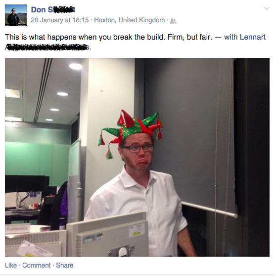

footer: Software project – Lecture 4
slidenumbers: true

# Software Project
### Lecture 4

### Wouter Swierstra

--------------------------------------------------------------------------------

# Last time

<br><br><br>

* Risks

* Software architecture

--------------------------------------------------------------------------------

## Working effectively with git and GitHub.

--------------------------------------------------------------------------------

# Collaborative software development

You have two weeks to finish your user stories.

And need to give a demo at the end.

But you need to work in parallel with many team members.

What to do?

--------------------------------------------------------------------------------

# What is git?

* A popular, powerful distributed file version control system
* Initiated by Linux's Linus Torvalds and developed by Junio Hamano
* It is free and obtainable from [git-scm.com](http://git-scm.com)
* Existing systems did not perform well enough, so Git was born
* In May 2012 somebody found that 27 percent of professional developers uses Git.

--------------------------------------------------------------------------------

# Starting a new repo

```
$ tar xzf project.tar.gz
$ cd project
$ git init
Initialized empty Git repository in .git/
$ vi .gitignore # Tell git what to ignore...
$ git add .    # add all files in project
$ git commit   # make your first commit
```

--------------------------------------------------------------------------------

# Preparing a commit

* Use `git add` to add new files to repo
* Indicate that certain changed files should be committed
* Delete an item from the repo

--------------------------------------------------------------------------------

```
$ git add olderfile.txt    # updated file
$ git add brandnew.txt    # new file
$ git rm deletable.txt     # old file, no local delete
$ git commit
```

--------------------------------------------------------------------------------
# Variants and abbreviations

```
$ git commit justthis.txt # use latest content only of justthis.txt
$ git commit -a    # use latest content of all tracked files
```

--------------------------------------------------------------------------------



--------------------------------------------------------------------------------

# GitHub

* Repository
* Issue tracker
* Wiki
* Useful graphical interface

--------------------------------------------------------------------------------


--------------------------------------------------------------------------------

# Further reading

* [Pro-git](http://git-scm.com/book/en/v2)


git diff
git log

\begin{frame}[fragile]
  \frametitle{As you construct the commit}
  \begin{itemize}
    \item After a commit Index and the HEAD are identical
    \item As you \code{add} and \code{rm}, Index starts to deviate
      from the HEAD.
\begin{notitleblock}    
\begin{verbatim}
$ git diff --cached # See what has changed
diff --git a/.gitignore b/.gitignore
index 2a85b92..0c85339 100644
--- a/.gitignore
+++ b/.gitignore
@@ -1,3 +1,4 @@
 dist/*
 build/*
+.svn      
\end{verbatim}
\end{notitleblock}
    \item After commit, HEAD := Index
    \item \verb|git diff| shows changes that will not be committed
   %  \item \verb|git status| gives a brief per-file summary of the above
  \end{itemize}
\end{frame}
 
\begin{frame}
  \frametitle{How do we stand? (part 1)}
  \begin{itemize}
    \item Run \code{gitk}. 
  \end{itemize}  
  \includegraphics[width=10cm]{gitkscreen1.png}
\end{frame}

\begin{frame}[fragile]
  \frametitle{Exploring the history}
  \begin{itemize}
    \item To find out what the latest commit was: \code{git show}
\begin{notitleblock}
\begin{verbatim}
commit 28cbe84da2877dc91ceeeb50755c74e84cdd9fc7
Author: Jurriaan Hage <jur@cs.uu.nl>
Date:   Thu Feb 28 10:48:45 2013 +0100

    Added .svn to ignore

diff --git a/.gitignore b/.gitignore
index 2a85b92..0c85339 100644
--- a/.gitignore
+++ b/.gitignore
@@ -1,3 +1,4 @@
 dist/*
 build/*
+.svn
\end{verbatim}
\end{notitleblock}
  \end{itemize}
\end{frame}

\begin{frame}[fragile]
  \frametitle{Commits}
  \begin{itemize}
    \item All commits are identified with a 40-hexdigit id, 
        28cbe84da2877dc91ceeeb50755c74e84cdd9fc7 
        (aka object name, aka SHA-1 id)
    \item It is a hash of the contents of the commit.
    \item Chance that it is not globally unique is microscopically small.
  \end{itemize}
\end{frame}

\begin{frame}[fragile]
  \frametitle{Tags}
  \begin{itemize}
    \item You can name these things:
\begin{notitleblock}
\begin{verbatim}
git tag readytogo
    28cbe84da2877dc91ceeeb50755c74e84cdd9fc7
 \end{verbatim}
\end{notitleblock}   
    \item To include more information with the reference, create a 
       \emph{tag object}
    \item Use tags to designate specific versions of the
      software system that you have released.
    \item As you commit, the HEAD moves forward to the new commit, but 
       tags stay put.
  \end{itemize}
\end{frame}

\begin{frame}
  \frametitle{How do we stand? (part 2)}
  \includegraphics[width=9.5cm]{gitkscreen2.png}
  \single{Note the parent and child reference, and the yellow tag.}
\end{frame}

\begin{frame}[fragile]
  \frametitle{Browsing the repo}
\begin{notitleblock}
\begin{verbatim}
$ git log   # all commits
$ git log v2.6.15..v2.6.16  # ...in v2.6.16, not in v2.6.15
$ git log test..master  # commits reachable from master but not test
$ git log --since="2 weeks ago" # commits from the last 2 weeks
$ git log Makefile      # commits which modify Makefile
$ git log src/     # commits which modify any file under src/
$ git show v2.6.15:a.txt  # look at v2.6.15 version of a.txt
$ git diff v2.6.15..HEAD    # diff with current head
$ git diff v2.6.15..v2.6.16  # diff between two tags
$ git grep "foo()"    # search working directory for "foo()"
\end{verbatim}
\end{notitleblock}
\end{frame}

\begin{frame}[fragile]
  \frametitle{Making a tarball}
\begin{notitleblock}
\begin{verbatim}
$ git archive --format=tar --prefix=project/ HEAD | 
      gzip >latest.tar.gz
$ tar tfz latest.tar.gz
project/
project/.gitignore
project/README
project/src/
project/src/Onlyloc.ag
project/src/Onlyloc.hs
project/src/Onlyloc.hs.visage
project/src/TODO
project/src/Test.ag
project/src/Test.hs
...
\end{verbatim}
\end{notitleblock}
\end{frame}

\begin{frame}[fragile]
  \frametitle{Branches}
  \begin{itemize}
    \item Development is not straight-line, but branching is natural    
    \item The master is by convention (like trunk in svn):
\begin{notitleblock}
\begin{verbatim}
$ git branch
* master
\end{verbatim} % $
\end{notitleblock}
  \end{itemize}
\end{frame}


\begin{frame}[fragile]
  \frametitle{Going experimental}
Create a new branch of the HEAD, to try out something new
\begin{notitleblock}
\begin{verbatim}
$ git branch experimental
$ git branch
  experimental
* master

# Variants:
$ git branch new v2.6.15 # tag named v2.6.15
$ git branch new HEAD^ # commit before the most recent
$ git branch new HEAD^^  # the one before that
$ git branch new test~10 # ten commits before 
                         # tip of branch "test"
\end{verbatim}
\end{notitleblock}  
\end{frame}

\begin{frame}
  \frametitle{How do we stand? (part 3)}
  \includegraphics[width=9.5cm]{gitkscreen3.png}
  \single{Note the additional branch in green}
\end{frame}

\begin{frame}[fragile]
  \frametitle{Changes to the (active) master branch}
\begin{notitleblock}
\begin{verbatim}
$ git rm -r workinprogress/
$ git commit
[master 92e269c] In the master branch, work in progress 
 is not needed
 1 file changed, 63 deletions(-)
 delete mode 100644 workinprogress/AttributeFrame.java
\end{verbatim}
\end{notitleblock}  
\end{frame}

\begin{frame}
  \frametitle{How do we stand? (part 4)}
  \includegraphics[width=9.5cm]{gitkscreen4.png}
  \single{Note that master moved on, but experimental did not}
\end{frame}

\begin{frame}[fragile]
  \frametitle{Switching branches}
\noindent Switch to the experimental branch:
\begin{notitleblock}
\begin{verbatim}
$ git checkout experimental
Switched to branch 'experimental'
$ git branch
* experimental
  master
\end{verbatim}
\end{notitleblock} 
\end{frame}

\begin{frame}
  \frametitle{How do we stand? (part 5)}
  \includegraphics[width=9.5cm]{gitkscreen5.png}
  \single{Note the red uncommitted changes warning (after changing
  a Java source file)}
\end{frame}

\begin{frame}
  \frametitle{How do we stand? (part 6)}
  \single{After a \code{git commit -a} all is peachy:}
  \includegraphics[width=9.5cm]{gitkscreen6.png}
\end{frame}

\begin{frame}[fragile]
  \frametitle{Switch back to the master}
\noindent Switch to the experimental branch:
\begin{notitleblock}
\begin{verbatim}
$ git checkout master
Switched to branch 'master'
$ git branch
  experimental
* master
\end{verbatim}
\end{notitleblock} 
\single{\code{workinprogress} directory is empty!}
\end{frame}

\begin{frame}[fragile]
  \frametitle{Merge experimental back in}
\begin{notitleblock}
\begin{verbatim}
$ git merge experimental
CONFLICT (modify/delete): 
workinprogress/AttributeFrame.java deleted in HEAD 
and modified in experimental. Version experimental 
of workinprogress/AttributeFrame.java left in tree.
Automatic merge failed; fix conflicts and then commit the result.
\end{verbatim}
\end{notitleblock} 
\single{\code{workinprogress} directory is not empty anymore!}
\end{frame}

\begin{frame}[fragile]
  \frametitle{Revolving the conflict}
  \begin{itemize}
    \item No need to edit the file, since I want to keep it whole:
  \end{itemize}  
\begin{notitleblock}
\begin{verbatim}
$ git commit -a
[master ebca5c1] Merge branch 'experimental'
\end{verbatim}
\end{notitleblock}
\end{frame}

\begin{frame}
  \frametitle{How do we stand? (part 7)}
  \single{Note the two parents (because of the merge):}
  \includegraphics[width=9.5cm]{gitkscreen7.png}
\end{frame}

\begin{frame}
  \frametitle{Up to now...}
  \begin{itemize}
    \item we have kept track of our own changes:
       commit and checkout HEAD move data between the local
       repo and the working directory
    \item So what about sharing work with others?
  \end{itemize}  
\end{frame}


\begin{frame}
  \frametitle{A (simplified) overview of the general set-up}
  \begin{center}
  \includegraphics[height=5.5cm]{GitDataFlowSimplified.png}
  (From Wikipedia)
  \end{center}
\end{frame}


\begin{frame}[fragile]
  \frametitle{Check out a remote repository}
\begin{notitleblock}
\begin{verbatim}
git clone git://git.kernel.org/pub/scm/git/git.git
cd git
\end{verbatim} % $
\end{notitleblock}
\end{frame}


\begin{frame}[fragile]
  \frametitle{Doing updates (also remote)}
  \begin{itemize}
    \item \code{git fetch} does an update from the repo's you cloned
      from.
    \item Also for remote branches:
\begin{notitleblock}
\begin{verbatim}
$ git remote add linux-nfs \
     git://linux-nfs.org/pub/nfs-2.6.git
$ git remote add gitself \ 
     git://git.kernel.org/pub/scm/git/git.git
$ git fetch gitself   # update from remote
$ git remote
gitself
linux-nfs
$ git remote remove linux-nfs # Changed my mind
\end{verbatim} % $
\end{notitleblock}  
      
  \end{itemize}
\end{frame}

\begin{frame}[fragile]
  \frametitle{Merging} 
  \begin{itemize}
    \item Now we  have fetched gitself, and want to merge its 
       \verb|master| branch into our current branch
    \item Merge may lead to numerous merge actions on your part
  \end{itemize}
\begin{notitleblock}
\begin{verbatim}
$ git branch
  experimental
* master
$ git branch -r
  gitself/maint
  gitself/master  # This is the one we want
  ...
$ git merge gitself/master # merge into current branch
$ edit README
$ edit .gitignore
$ git add README .gitignore
$ git commit    # merge commited after resolving conflicts 
\end{verbatim}
\end{notitleblock}   
\end{frame}

\begin{frame}
  \frametitle{How do we stand? (part 8)}
  \single{After this large merge:}
  \vspace*{-0.5cm}
  \includegraphics[width=9.5cm]{gitkscreen8.png}
\end{frame}

\begin{frame}[fragile]
  \frametitle{Pull}
  \begin{itemize}
    \item Often we want to combine \verb|fetch| with \verb|merge|, and for that
      you can use \verb|pull|
    \item 
  \end{itemize}
\begin{notitleblock}
\begin{verbatim}
$ git pull . gitself/master
$ git pull     # if the remote branch is ``tracked''
\end{verbatim}
\end{notitleblock}
To employ tracking, 
\begin{notitleblock}
\begin{verbatim}
$ git branch --track gitmaster gitself/master
$ git checkout gitmaster   # Switch to gitmaster
$ git pull   # Get the latest from remote and merge it in
\end{verbatim}
\end{notitleblock}
\end{frame}

\begin{frame}[fragile]
  \frametitle{Sharing changes with others}
  \begin{itemize}
    \item Make patches available to others by mail
    \item Or use push and pull. For push you need
      write access to that repo.
  \end{itemize}
\begin{notitleblock}
\begin{verbatim}
$ git format-patch origin..HEAD   
$ git am mbox 
    # import patches from the mailbox "mbox"
\end{verbatim}
\end{notitleblock}
\end{frame}

\begin{frame}[fragile]
  \frametitle{Not covered}
  \begin{itemize}
    \item garbage collection \verb|$ git gc|
    \item check repo \verb|$ git fsck|
    \item packing
    \item dangling objects
    \item submodules
  \end{itemize}
\end{frame}

\begin{frame}\frametitle{Git hosting}
  There are plenty of (free) options for hosting a git repository.
  \begin{itemize}
  \item GitHub is probably the most famous
    \begin{itemize}
    \item Lots of users, great community;
    \item Limits on private repositories;
    \item Great place to host open source projects.
    \end{itemize}
  \item Bitbucket 
    \begin{itemize}
    \item Supports Mercurial and Git;
    \item Similar features to Github, different pricing model.
    \end{itemize}
  \item ... and lots of others.
  \item It's worth exploring which option works for you.
  \end{itemize}
\end{frame}

\begin{frame}\frametitle{Why use a hosting website?}
  \begin{itemize}
  \item No need to set up your own server;
  \item Provides free wiki and bug tracker.
  \item Use them!
  \item Wikis are a cheap way to record information like requirements,
    iteration info, a glossary, etc.
  \item Use the bug tracker for your product backlog.
  \item Both need maintainence!
  \end{itemize}
\end{frame}


